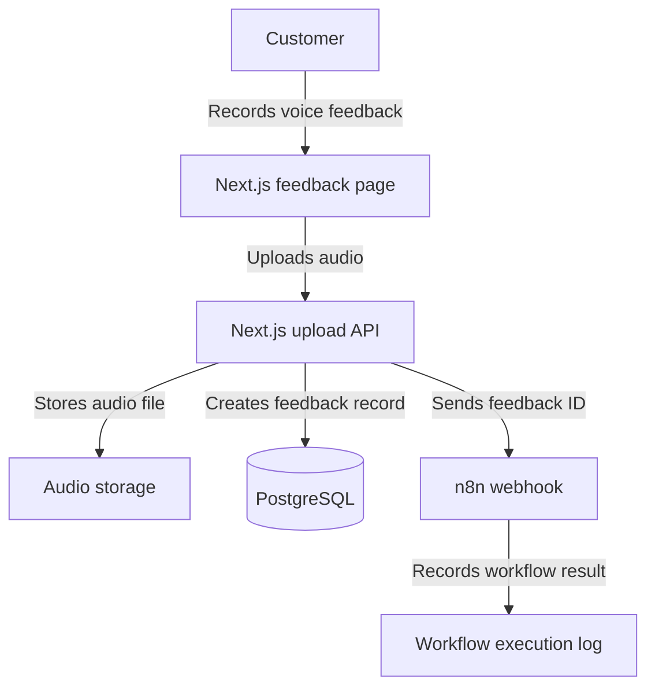
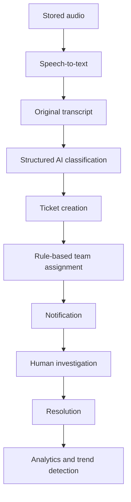

# Voice2Action Architecture

## What architecture means

The architecture is a map of the system. It shows each major component, its responsibility, and how information moves between components.

## Phase 1 architecture

## Component responsibilities

### Customer feedback page

The page allows a customer to:

- Give microphone permission.
- Start and stop recording.
- Listen to the recording.
- Delete the recording and try again.
- Submit the recording.
- See a success or error message.

### Next.js upload API

The API will:

- Receive the audio file.
- Check that the upload is valid.
- Generate a unique feedback ID.
- Store the audio file.
- Create a PostgreSQL record.
- Notify n8n.
- Return a safe response to the customer.

### Audio storage

Audio files will be stored separately from PostgreSQL.

Local file storage may be used during early development. Cloud object storage can be added when the basic workflow is reliable.

### PostgreSQL

PostgreSQL will store structured information such as:

- Feedback ID.
- Audio location.
- Submission time.
- Processing status.
- Transcript.
- Category.
- Sentiment.
- Urgency.
- Recommended action.

The AI-related fields will remain empty until Phase 2.

### n8n

n8n coordinates automated workflows. It is not the entire application.

During Phase 1, n8n will receive the feedback ID and record that the webhook worked. Later, it will coordinate transcription, AI classification, routing, notifications, and scheduled workflows.

## Phase 1 data flow

1. The customer records an audio message.
2. The browser sends the recording to the Next.js API.
3. The API validates the recording.
4. The API generates a unique feedback ID.
5. The API stores the audio file.
6. The API creates a PostgreSQL record with the status `RECEIVED`.
7. The API sends the feedback ID to an n8n webhook.
8. The API returns a success message to the customer.

## Future architecture

## Design rules

- AI recommends; a human can review and override.
- Store the original transcript for auditing.
- Validate AI output before saving it.
- Keep audio files outside the transactional database.
- Use clear routing rules before attempting AI-powered routing.
- Do not commit passwords or API keys.
- Add logging and error handling to every important workflow.
- Build and test one small end-to-end path before adding advanced features.