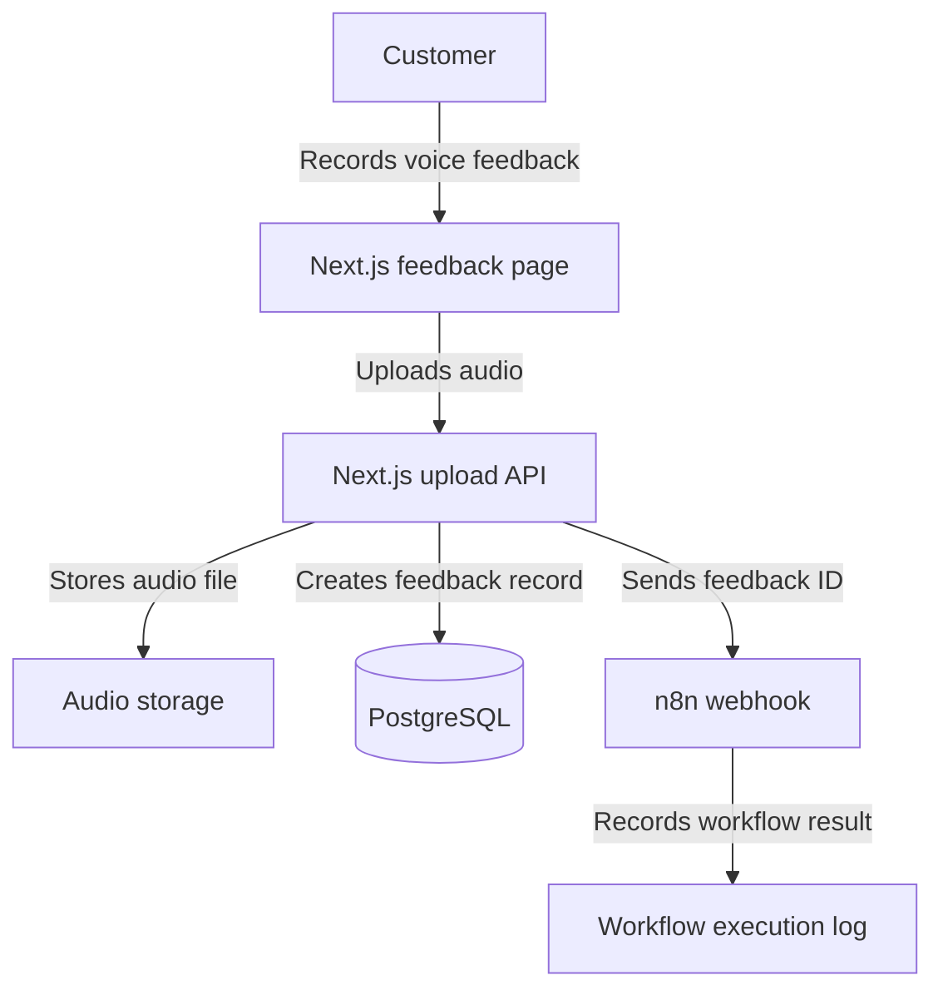
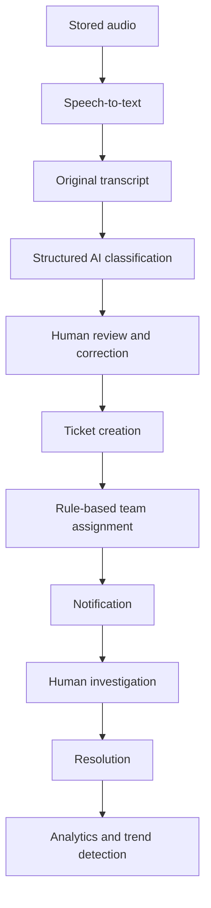

# Voice2Action Architecture

## What architecture means

The architecture is a map of the system. It shows each major component, its responsibility, and how information moves between components.

## Phase 1 architecture

## Component responsibilities

### Customer feedback page

The page allows a customer to:

- Give microphone permission.
- Start and stop recording.
- Listen to the recording.
- Delete the recording and try again.
- Submit the recording.
- See a success or error message.

### Next.js upload API

The API will:

- Receive the audio file.
- Check that the upload is valid.
- Generate a unique feedback ID.
- Store the audio file.
- Create a PostgreSQL record.
- Notify n8n.
- Return a safe response to the customer.

### Audio storage

Audio files will be stored separately from PostgreSQL.

Local file storage may be used during early development. Cloud object storage can be added when the basic workflow is reliable.

### PostgreSQL

PostgreSQL will store structured information such as:

- Feedback ID.
- Audio location.
- Submission time.
- Processing status.
- Transcript.
- Category.
- Sentiment.
- Urgency.
- Recommended action.

The AI-related fields will remain empty until Phase 2.

### n8n

n8n coordinates automated workflows. It is not the entire application.

During Phase 1, n8n will receive the feedback ID and record that the webhook worked. Later, it will coordinate transcription, AI classification, routing, notifications, and scheduled workflows.

## Phase 1 data flow

1. The customer records an audio message.
2. The browser sends the recording to the Next.js API.
3. The API validates the recording.
4. The API generates a unique feedback ID.
5. The API stores the audio file.
6. The API creates a PostgreSQL record with the status `RECEIVED`.
7. The API sends the feedback ID to an n8n webhook.
8. The API returns a success message to the customer.

## Future architecture

## Phase 2 local transcription slice

The upload API and n8n webhook still handle receipt. After n8n accepts the event, the upload API queues transcription on that feedback row. A separate worker polls PostgreSQL for queued `RECEIVED` feedback, reads its audio file from `storage/audio`, runs a local Faster-Whisper model on the CPU, and writes the original transcript and completion time to the same feedback row. Older Phase 1 recordings are not queued automatically. The worker records a failure reason and marks the row `FAILED` if transcription fails. It does not send the recording to a hosted transcription API. The model files download once into ignored `storage/models`; after that, inference is local.

For this slice, `PROCESSING` means transcription has started and `PROCESSED` means a transcript was saved. Later classification and ticket statuses may need a more detailed state model.

## Phase 2 local classification slice

A separate worker polls for `PROCESSED` feedback with a transcript and no category, claims one row, and sends the transcript to a local Python classifier over stdin. The classifier builds a small TF-IDF model from synthetic examples and returns a category, extractive short description, match score, review flag, and model version. It makes no network request. The worker validates that result and saves it to the same feedback row without changing the original transcript or audio. A low or ambiguous match is `OTHER` and needs review. A classification failure is recorded separately from transcription failure, so the transcript remains available. A lease lets another worker recover a claim after a crash. This is a limited English-only first pass; ticket creation and team routing remain future work.

## Phase 2 local human-review slice

A local-only interactive command loads one feedback record by ID and shows the original model output. The operator can correct the wording, choose a category, edit the short description, and must explicitly confirm before saving. Reviewed fields and review time are separate from the original transcript and model classification. An integer review revision prevents one review session from silently overwriting a concurrent change. All feedback still requires human review before a future ticket is created, even if the classifier's automated review flag is false. No public review API or ticket creation is added in this slice.

## Phase 2 review-gated ticket slice

A local interactive command previews a ticket from reviewed feedback and requires explicit confirmation. Creation uses one atomic `INSERT ... SELECT` statement that succeeds only when all reviewed fields and a positive review revision exist. The ticket snapshots the reviewed title, description, category, review time, and revision. A unique database index on `feedback_id`, together with `ON CONFLICT DO NOTHING`, makes repeated or concurrent creation requests idempotent. Tickets receive a readable reference such as `TKT-000001` and start as `OPEN`. This slice has no public ticket API, assignment logic, notifications, or status-transition interface.

## Phase 2 local ticket-status slice

A local interactive command previews and explicitly confirms one forward status transition at a time: `OPEN` → `IN_PROGRESS` → `RESOLVED` → `CLOSED`. The database update includes the status that the operator originally saw, so a stale terminal cannot silently overwrite a concurrent change. Closed tickets cannot advance further. This initial workflow is local-only and intentionally does not support skipping stages or reopening tickets.

## Phase 2 rule-based team-assignment slice

Reviewed ticket categories map deterministically to an operational team under a versioned local rule set. New tickets save their team atomically during creation. A local confirmation command assigns tickets created before this feature, and its conditional update prevents concurrent duplicate assignment. Assignment data includes the selected team, rule version, and timestamp. Unknown categories cannot be assigned silently; the reviewed `OTHER` category routes to General Support. This slice does not notify the team or support manual reassignment.

## Phase 2 local notification-outbox slice

A PostgreSQL trigger creates one `PENDING` notification whenever a ticket first receives a team. Notification creation occurs in the same transaction as ticket creation or assignment, and a unique ticket-and-event constraint prevents duplicate assignment notifications. The migration backfills already-assigned tickets. A read-only local command lists pending messages without pretending they were externally delivered. Delivery attempts, errors, and sent timestamps are modeled for a later email or chat worker.

## Phase 2 local operations-dashboard slice

A server-rendered Next.js page reads tickets, status totals, team ownership, and pending notifications directly from PostgreSQL. Database credentials and raw records stay on the server. A Server Action advances tickets by one valid step, re-reads trusted database state, validates the ticket identifier, uses an optimistic status condition, and revalidates the dashboard. Both page and mutation are restricted to localhost. The browser form requires an explicit confirmation checkbox. This is a local operator tool, not a public authenticated administration surface.

## Phase 2 ticket-detail and manual-controls slice

A localhost-only dynamic route loads one ticket by its numeric reference and includes the linked feedback audit trail and notification history. Server Actions let an operator explicitly confirm a team reassignment or mark a pending notification as delivered. Reassignment uses a conditional ticket update inside a database transaction, marks the assignment as manual, and upserts the single assignment notification back to `PENDING` for the selected team. Notification delivery uses a conditional state update so a stale page cannot overwrite a concurrent queue change. The controls simulate local operational handling only; they do not send email or chat messages.

## Phase 2 dashboard search-and-filter slice

The operations page reads request-time URL search parameters and validates each value against the known ticket status, team, and category sets. A free-text query searches ticket title and description case-insensitively and recognizes readable references such as `TKT-000001`. Prisma receives only validated filters. A separate count query reports total matches while the result query remains capped at 50 recent tickets. Summary metrics and the pending-notification queue remain global operational context rather than changing with the ticket filters.

## Phase 2 local operations-analytics slice

A localhost-only server-rendered analytics route reads the 500 most recent tickets from PostgreSQL and aggregates them in application memory. It reports lifecycle distribution, assigned-team distribution, category mix, completion rate, and age buckets for tickets still open or in progress. A conservative recurring-issue detector normalizes ticket titles and groups them with their category inside a rolling 30-day window; a group is surfaced only at two or more occurrences. The page uses semantic HTML and CSS bars, so no client charting library or additional browser JavaScript is required.

## Phase 2 browser-review-inbox slice

A localhost-only server-rendered review queue reads feedback that has an original transcript but no saved human review. It also shows completed reviews that have not yet produced a ticket. A dynamic review route displays the immutable transcript and classifier result beside a correction form. Its Server Action validates all submitted fields again, requires explicit confirmation, and conditionally updates the feedback row only when the submitted review revision still matches and no ticket exists. Successful saves increment the revision and revalidate the review and operations pages. Ticket creation remains a separate action so reviewing data never silently creates operational work.

## Phase 2 browser-ticket-creation slice

The review detail route previews the saved title, category, assigned team, starting status, and source revision before ticket creation. A localhost-only Server Action requires explicit confirmation and uses a conditional `INSERT ... SELECT` guarded by the submitted review revision. The statement copies only completed reviewed fields, resolves the assigned team through the same versioned rule map as the terminal workflow, and uses the feedback uniqueness constraint for idempotency. The existing PostgreSQL assignment trigger adds the notification outbox row in the same transaction. Repeated or concurrent requests resolve to the existing ticket and redirect to its detail page.

## Phase 2 ticket-work-log slice

The ticket detail route reads typed work-log entries through the ticket relation and displays them newest first. A localhost-only Server Action validates the ticket identifier, entry type, confirmation, and a 5,000-character body limit before appending a row. The interface exposes no edit or delete action, and closed tickets reject new entries. Advancing an in-progress ticket queries for at least one `RESOLUTION` entry before conditionally updating the status, so resolution has recorded evidence while the existing optimistic concurrency guard remains in place.

## Design rules

- AI recommends; a human can review and override.
- Store the original transcript for auditing.
- Validate AI output before saving it.
- Keep audio files outside the transactional database.
- Use clear routing rules before attempting AI-powered routing.
- Do not commit passwords or API keys.
- Add logging and error handling to every important workflow.
- Build and test one small end-to-end path before adding advanced features.
